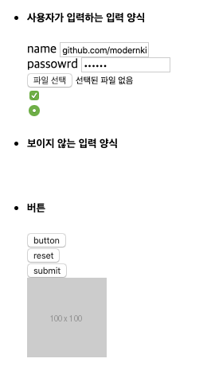
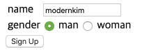
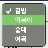
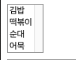
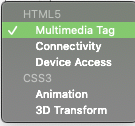
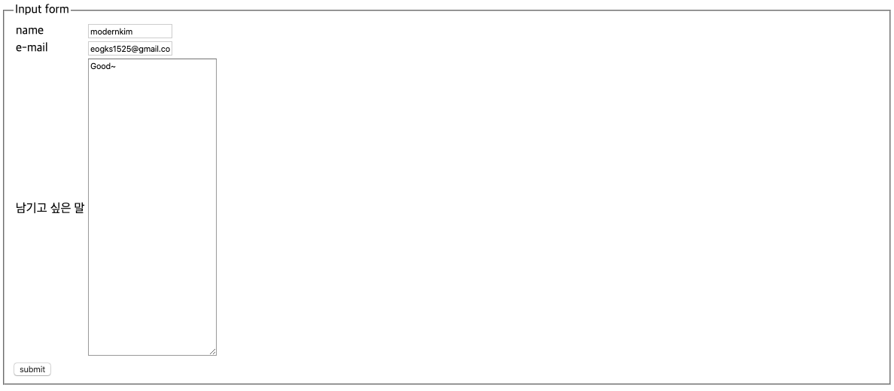
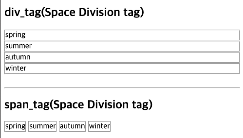
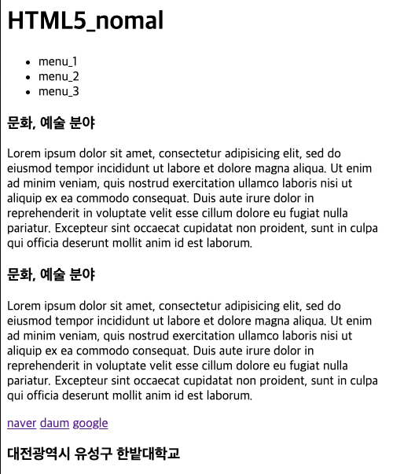
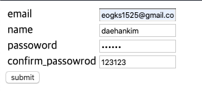
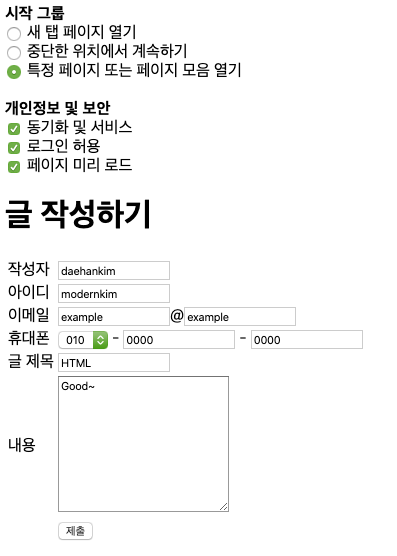

## Task_01 <u>example_01.html </u>/ <u>example_02.html</u>

## Task_02 <u>example_03.html</u> /<u> example_04.html</u>

## Task_03 <u>example_05.html</u> /<u> example_06.html</u>

## Task_04 <u>Question_05.html</u> /<u> Question_06.html</u>

## Task_05 <u>assignment.html</u>

