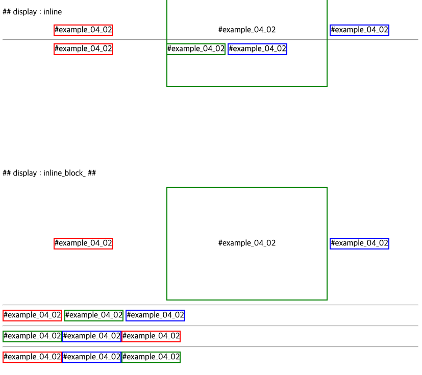

| #example_01.html                  |#example_02.html                  |
| :------------------- | :------------------- |
|  | |
| #example_03.html                  |#example_04_01.html                  |
|  | |
| #example_04_02.html                          |
|  |
