| #example_01.html (_01)                  |#example_01.html (_02)                  |
| :------------------- | :------------------- |
| 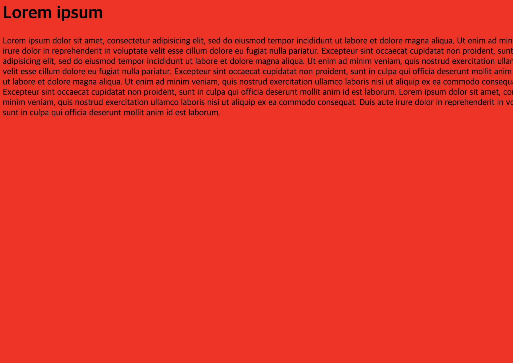 | 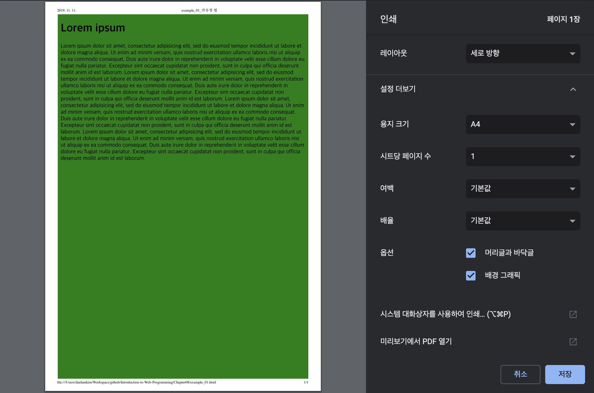|
| #example_02.html (_01)                  |#example_02.html (_02)                 |
| 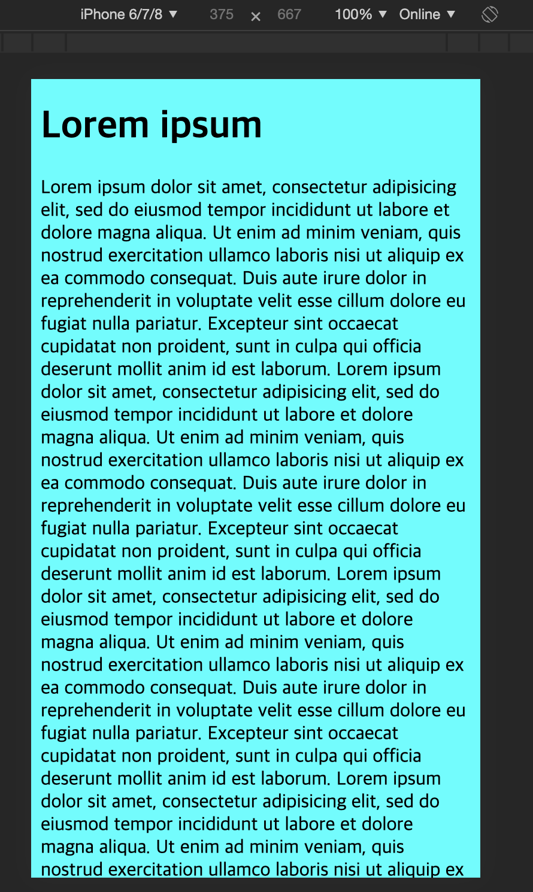 | |
| #example_02.html (_03)                  |                  |
| 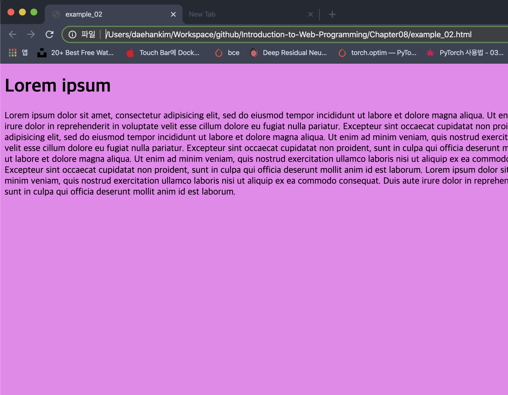 | |
| #example_03.html (_01)                |#example_03.html (_02)                  |
| 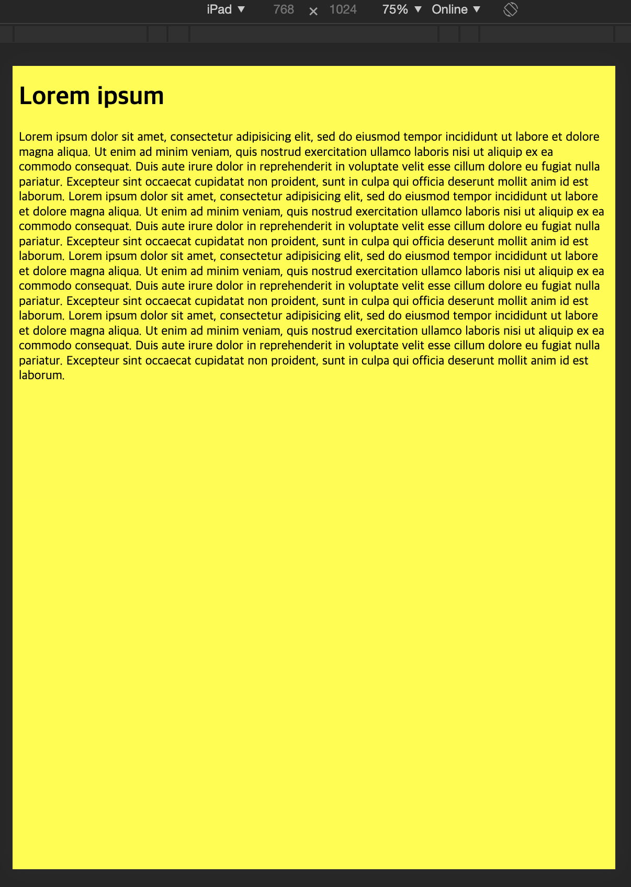 | 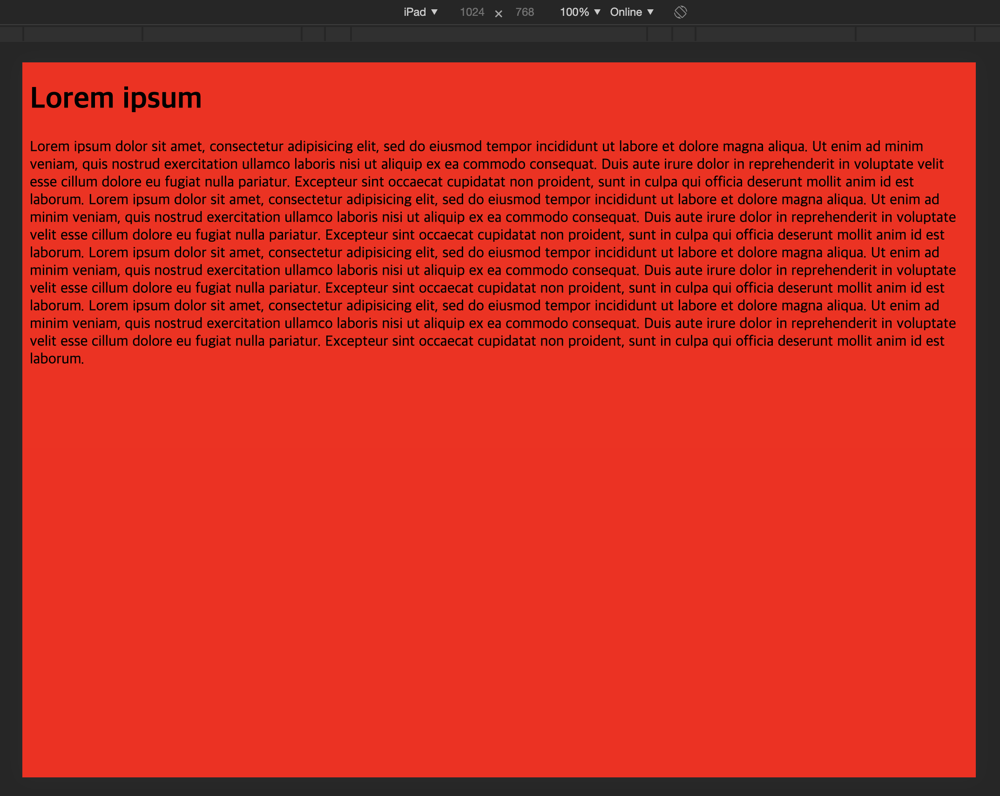|
| #example_04.html (_01)                  |#example_04.html (_02)                  |
| 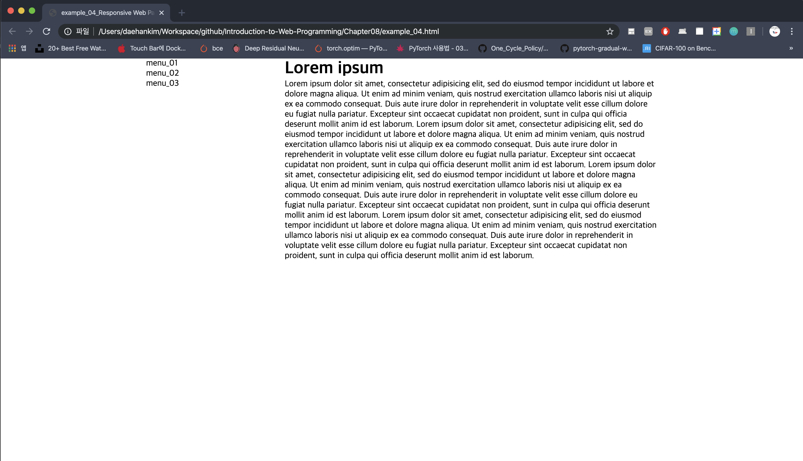 | 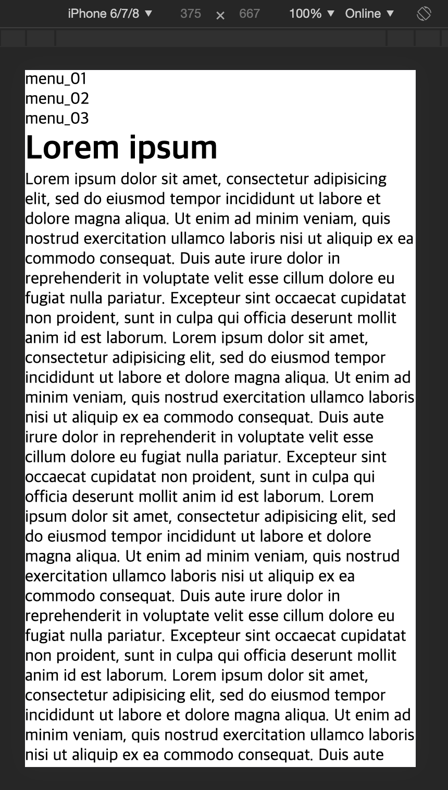|
| #example_05.html (_01)                  |    #example_05.html (_02)           |
| 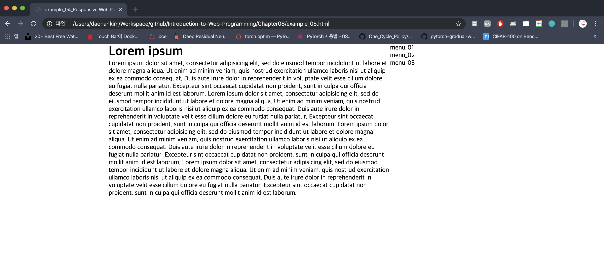 |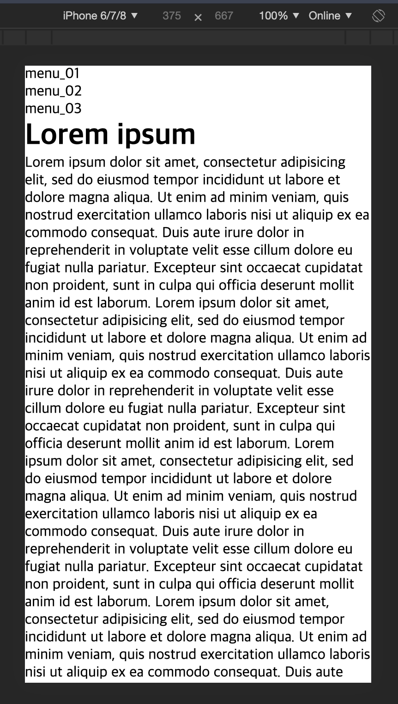|
| #example_06.html (_01)                  |    #example_06.html (_02)           |
| 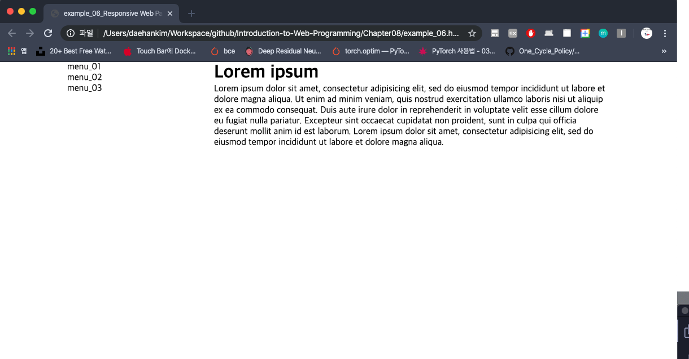 |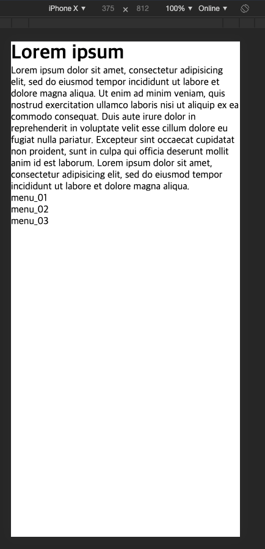|
| #example_07.html (_01)                  |    #example_07.html (_02)           |
| 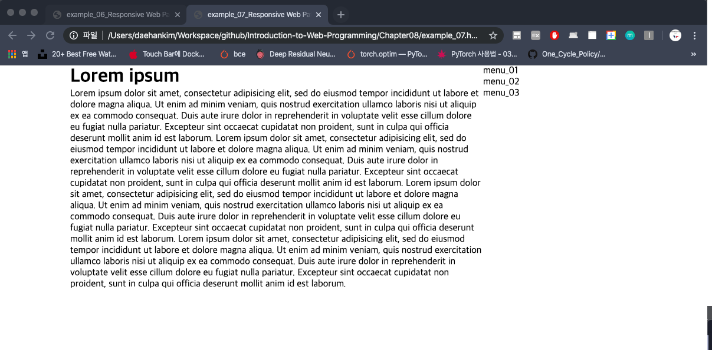 |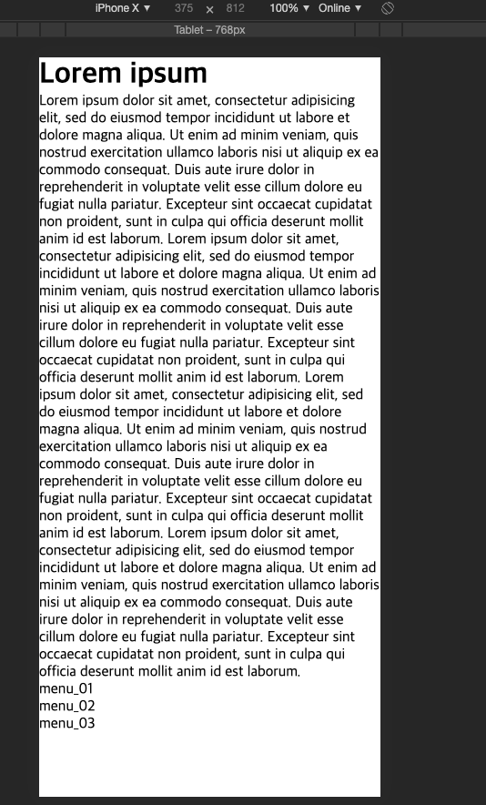|

