| #example_01.html                  |#example_02.html                  |
| :------------------- | :------------------- |
| 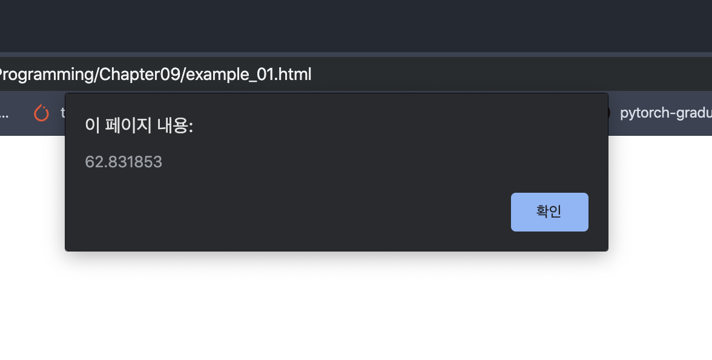 | 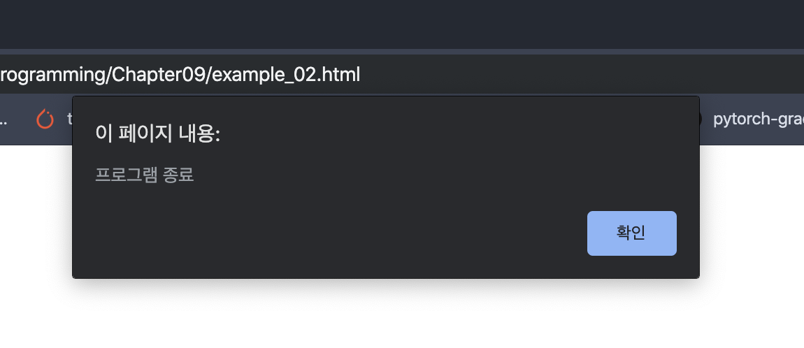|
| #example_03.html                  |#example_04.html             |
| 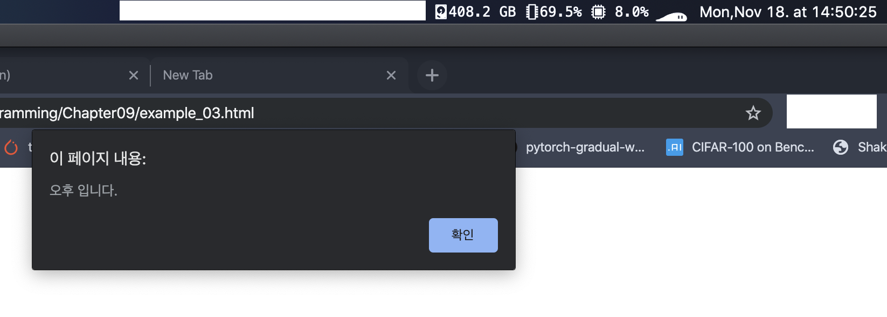 | 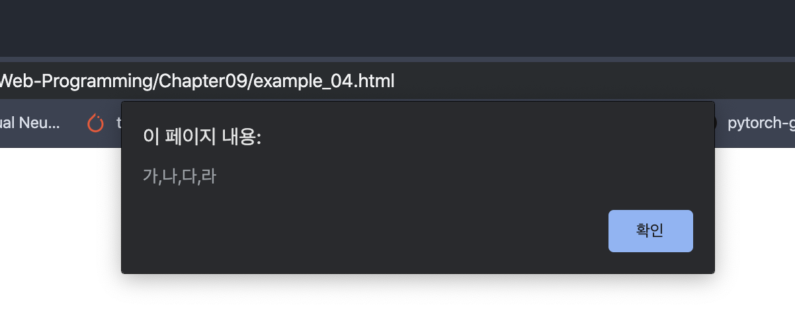|
| #example_05.html                  |#example_06.html                    |
| 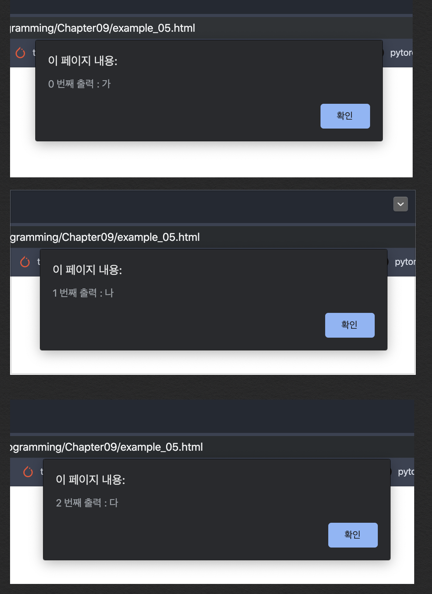 |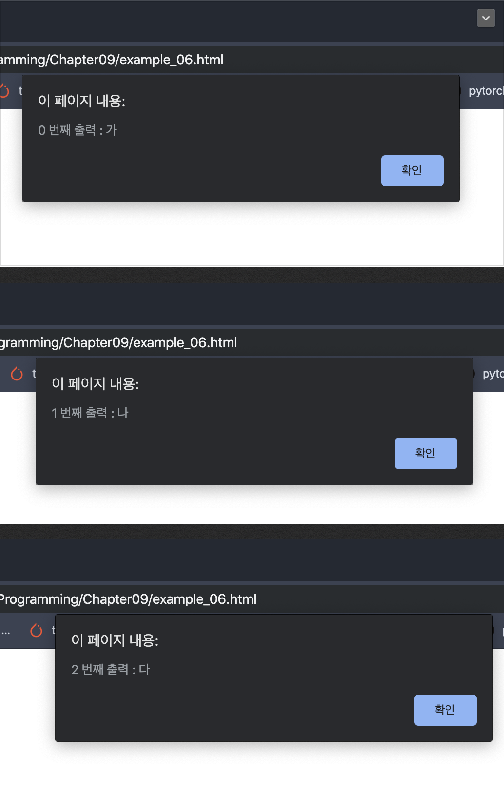 |
| #example_07.html                  |#example_08.html                    |
| 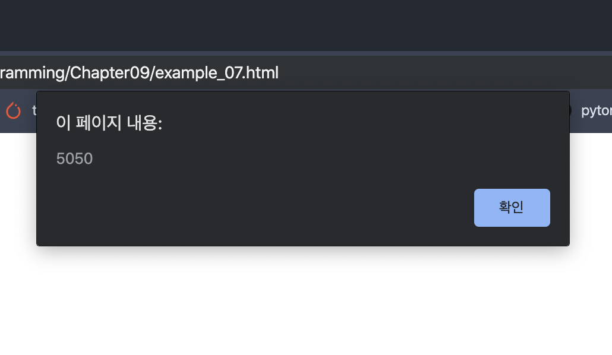 | 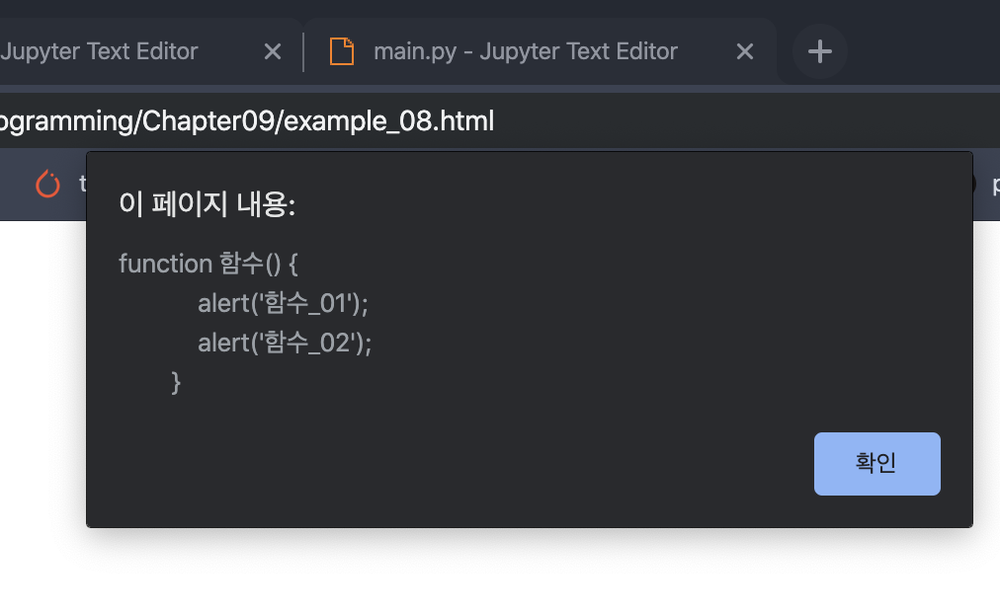  |
| #example_09.html                  |#example_10.html                    |
| 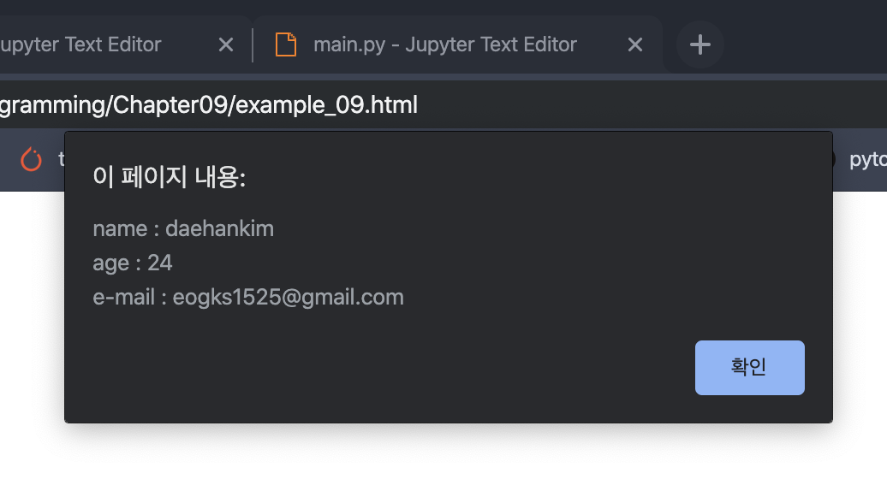 | 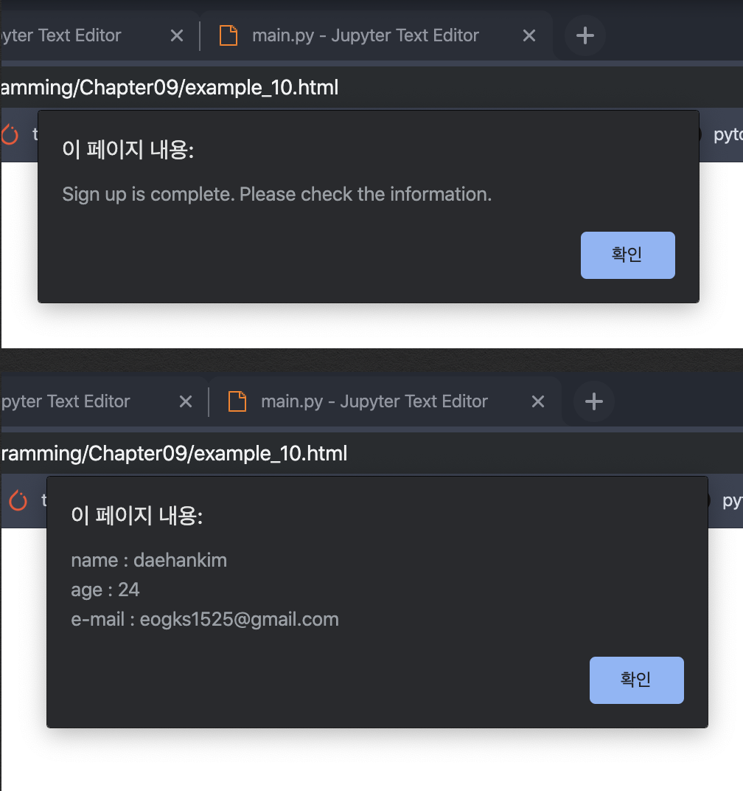  |
| #example_11.html                  |#example_12.html                    |
| 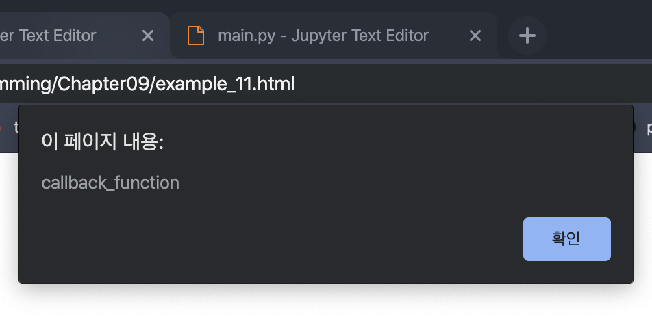 | 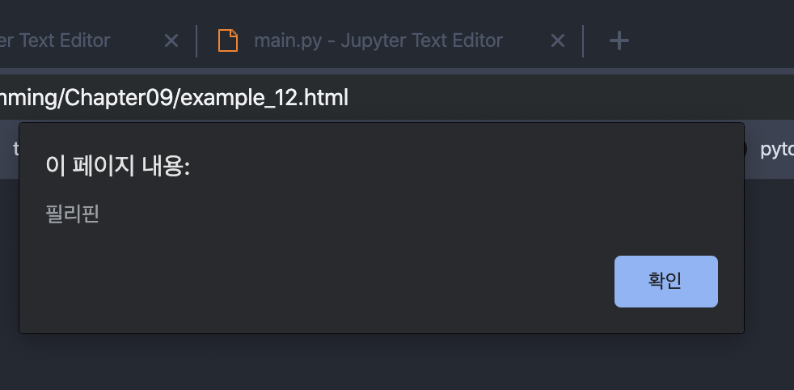  |
| #example_13.html                  | #example_14.html                     |
| 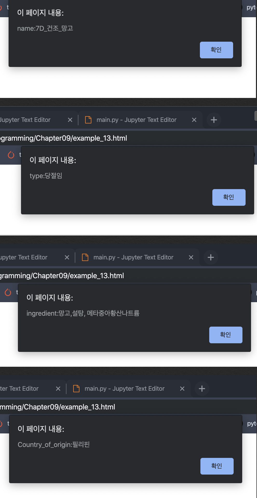 | 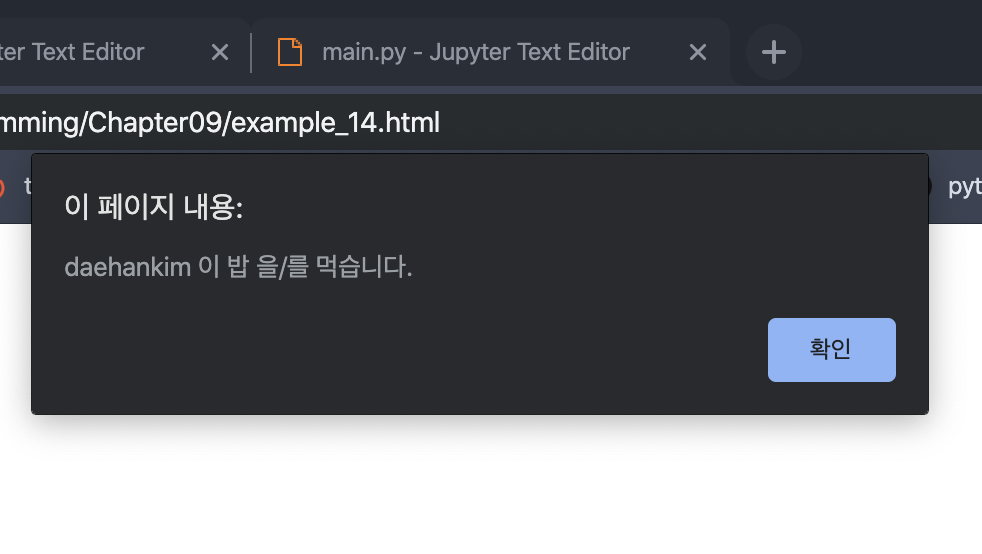|

